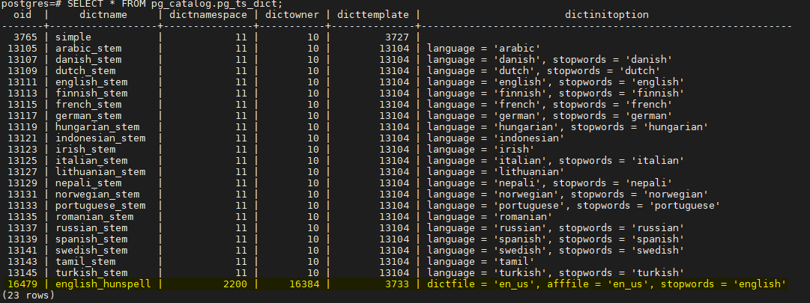
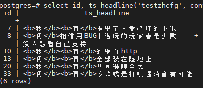
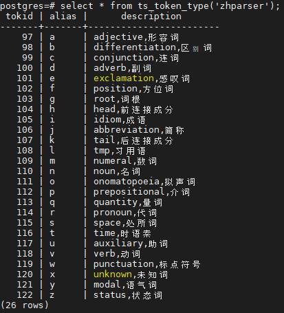

# Full text search of postgresql
Testing full text searching with Chinese language.

## Reference
* https://www.itread01.com/content/1545704120.html
* https://www.itread01.com/content/1562861174.html
* https://developer.aliyun.com/article/7730
* https://github.com/hightman/scws
* https://github.com/amutu/zhparser#configuration
* https://gist.github.com/bruce-shi/af5b03e2fa307bd0f5fe2173e65b6e76
* http://www.xunsearch.com/scws/docs.php
* [Text Search Functions and Operators](https://www.postgresql.org/docs/12/functions-textsearch.html#TEXTSEARCH-FUNCTIONS-TABLE)

## Environment
* CentOS-8.1.1911-x86_64
* Postgresql-12
* [scws v1.2.3](https://github.com/hightman/scws)
* [zhparser v1.2.0](https://github.com/amutu/zhparser)

## Installation
Steps to install postgresql and parser.
### Install postgresql
1. Disable native postgresql:
   ```shell script
   dnf -qy module disable postgresql
   ```
1. Install postgresql:
   ```shell script
   dnf install https://download.postgresql.org/pub/repos/yum/reporpms/EL-8-x86_64/pgdg-redhat-repo-latest.noarch.rpm
   dnf install postgresql12 postgresql12-server postgresql12-contrib postgresql12-devel
   /usr/pgsql-12/bin/postgresql-12-setup initdb
   ```
1. Go to postgresql config directory:
   ```shell script
   cd /var/lib/pgsql/12/data
   ```
1. Create [zhparser.conf](zhparser.conf) with below settings:
   ```shell script
   zhparser.seg_with_duality=f
   zhparser.multi_short=t
   zhparser.punctuation_ignore=t
   zhparser.multi_zmain=f
   zhparser.multi_zall=f
   ```
1. Setup postgresql config for testing:
   * [postgresql.conf](postgresql.conf)
     * change ``` listen_addresses = 'localhost' ``` to ``` listen_addresses = '*' ```
       
     * add ``` include = 'zhparser.conf' ```
       
   * [pg_hba.conf](pg_hba.conf)
     * add ``` host    all             all             all                     password ```
       
1. Start postgresql service even after reboot:
   ```shell script
   systemctl enable postgresql-12 ; systemctl start postgresql-12
   ```
1. Allow connection to postgresql from outside:
   ```shell script
   firewall-cmd --zone=public --permanent --add-service=postgresql ; firewall-cmd --reload
   ```
1. Create DB user for testing:
   ```shell script
   createuser -d -P -s test
   ```

### Install scws
1. Install general development tools, eg: make, C libraries...:
   ```shell script
   dnf group install "Development Tools"
   ```
   > Skip this step if it was installed.
1. Install scws:
   ```shell script
   cd /tmp
   wget -q -O - http://www.xunsearch.com/scws/down/scws-1.2.3.tar.bz2 | tar jxf -
   cd scws-1.2.3
   ./configure --prefix=/usr/local/scws ; make install
   ```
1. Check scws version:
   ```shell script
   scws -version
   ```
   

### Install zhparser
1. Install needed packages:
   ```shell script
   dnf install https://download-ib01.fedoraproject.org/pub/epel/8/Everything/x86_64/Packages/c/ccache-3.7.7-1.el8.x86_64.rpm
   dnf install clang llvm
   ```
   > Search at [pkgs.org](https://pkgs.org) for unknown package.

   > Skip this step if it was installed.
1. Install zhparser:
   ```shell script
   cd /tmp
   git clone https://github.com/amutu/zhparser.git
   cd zhparser
   PG_CONFIG=/usr/pgsql-12/bin/pg_config make && make install
   ```
   > You can execute ``` export PATH=/usr/pgsql-12/bin:$PATH ; make && make install ``` instead of last command.
1. Check zhparser is installed:
   ```sql
   select * from pg_ts_parser;
   ```
   
---
# Testing
## Prepare text search config
I will use hunsepll to parse English, and zhparser for Chinese.
#### Create hunspell dictionary
1. Download dictionary:
    ```shell script
    cd /usr/pgsql-12/share/tsearch_data
    wget https://cgit.freedesktop.org/libreoffice/dictionaries/plain/en/en_US.dic
    wget https://cgit.freedesktop.org/libreoffice/dictionaries/plain/en/en_US.aff
    mv en_US.dic en_us.dict
    mv en_US.aff en_us.affix
    ```
1. Create [hunspell](https://www.postgresql.org/docs/12/textsearch-dictionaries.html#TEXTSEARCH-ISPELL-DICTIONARY) dictionary to parse English rather than default parser:
   ```sql
   CREATE TEXT SEARCH DICTIONARY english_hunspell (
           TEMPLATE = ispell,
           DictFile = en_us,
           AffFile = en_us,
           Stopwords = English);
   ```
1. List all dictionaries:
   ```sql
   SELECT * FROM pg_catalog.pg_ts_dict;
   ```
   

#### Create search config
1. Create text search config:
   ```sql
   CREATE TEXT SEARCH CONFIGURATION testzhcfg (PARSER = zhparser);
   ALTER TEXT SEARCH CONFIGURATION testzhcfg alter MAPPING FOR a, b, c, d, e, f, g, h, i, j, k, l, m, n, o, p, q, r, s, t, u, v, w, x, y, z with english_hunspell, simple;
   ```

## Test text parsing
Let's parse a English text first:
```sql
select to_tsvector('testzhcfg', 'Thank u to every single person that used this song in a YouTube video or tiktok or just shared it with your friends. I had a lot of fun filming this video! Love is all we need ❤ - Powfu');
```


SQL result is in ___token:position___ format.
For example, 'every:4' means 'every' is recognized as one of tokens and the position is 4 in original text.
And ''video':14,32' means 'video' is at position 14 and 32.

Then parse a traditional Chinese text:
```sql
select to_tsvector('testzhcfg', '基隆 傳說中的蝦仁排骨飯 …人多好吃…排好久 ！蝦仁 有點油 ……建議 1：00再來 。');
```


Another simplified Chinese text:
```sql
select to_tsvector('testzhcfg', '「胜日寻芳泗水滨，无边光景一时新。」姹紫嫣红开遍，春天的大自然总是令人向往。');
```


## More practical example
We will create a table to store file content and search these data.

First, create a table using one of below procedures:
* postgresql version < 12
```sql
CREATE TABLE public.user_file (
	id int8 NOT NULL GENERATED BY DEFAULT AS IDENTITY,
	content text NULL,
	text_search_content tsvector NULL,
	CONSTRAINT user_file_pk PRIMARY KEY (id)
);

CREATE INDEX text_search_content_idx ON user_file USING GIN(text_search_content);

CREATE TRIGGER text_search_content_update BEFORE INSERT OR UPDATE
ON user_file FOR EACH ROW EXECUTE FUNCTION
tsvector_update_trigger(text_search_content, 'public.testzhcfg', content);
```
* postgresql version >= 12
```sql
CREATE TABLE public.user_file (
	id int8 NOT NULL GENERATED BY DEFAULT AS IDENTITY,
	content text NULL,
	text_search_content tsvector NULL GENERATED ALWAYS AS (to_tsvector('testzhcfg', coalesce(content, ''))) STORED,
	CONSTRAINT user_file_pk PRIMARY KEY (id)
);

CREATE INDEX text_search_content_idx ON user_file USING GIN(text_search_content);
```

To [speed up searching](https://www.postgresql.org/docs/12/textsearch-tables.html#TEXTSEARCH-TABLES-INDEX), a text_search_content column stores tokens, and a GIN index is created.

Add some dummy data into table by using [dummy_data](sql/dummy_data.sql).

Now let's do searching and [highlight](https://www.postgresql.org/docs/12/textsearch-controls.html#TEXTSEARCH-HEADLINE) the result with below SQL:
```sql
select id, ts_headline('testzhcfg', content, to_tsquery('testzhcfg', '我們'), 'MinWords = 5, MaxWords = 20')
from user_file uf where text_search_content @@ to_tsquery('testzhcfg', '我們') limit 10;
```
or
```sql
select id, ts_headline('testzhcfg', content, query, 'MinWords = 5, MaxWords = 20')
from user_file uf, to_tsquery('testzhcfg', '我們') query where text_search_content @@ query limit 10;
```



You can specified highlight tag with ___StartSel___ and ___StopSel___ options of ts_headline, default is &lt;b&gt; and &lt;/b&gt;.

# Turning
Several actions can be used to meet requirements.

* Adjust token type to parse

  To list all supported token type for a parser:
  ```sql
  select * from ts_token_type('zhparser');
  ```
  

  Then alter needed mapping of text search mapping, for example:
  ```sql
  ALTER TEXT SEARCH CONFIGURATION testzhcfg alter MAPPING FOR a, e, g, l, n, r, v, x with english_hunspell, simple;
  ```
  More mapping token type usage, more parsed results (tokens) for a text, but maybe more space to store or unnecessary results.

* Add customized word

  Special words can be inserted into zhparser.zhprs_custom_word:
  
  > Column attr value: '@' means use this word; '!' means not use or parse the word.

  > TODO: the meaning of tf and idf.

  For example:
  ```sql
  INSERT INTO zhparser.zhprs_custom_word (word) VALUES ('資金');
  ```
  When '資金' appears in text, it will be pasred as '資金' first.

  After updating or insertion, it's necessary to execute below SQL and reconnect to DB:
  ```sql
  select sync_zhprs_custom_word();
  ```

* Dynamic change [zhparser config](https://github.com/amutu/zhparser#configuration) via SQL:
  ```sql
  set zhparser.seg_with_duality=off;
  set zhparser.multi_short=off;
  set zhparser.punctuation_ignore=on;
  set zhparser.multi_zmain=off;
  set zhparser.multi_zall=off;
  ```
  Try different combinations to meet the requirement, then save it to [zhparser.conf](zhparser.conf).

* Debug how a text is parsed via SQL:
  ```sql
  SELECT * FROM ts_debug('testzhcfg', '保障房資金壓力逗號');
  ```
  
  * 'alias' and 'description' columns show what token type is used to get the token.
  * 'dictionaries' column lists all dictionaries for testzhcfg text search config.
  * 'dictionary' column shows the dictionary is used. See [Simple Dictionary](https://www.postgresql.org/docs/12/textsearch-dictionaries.html#TEXTSEARCH-SIMPLE-DICTIONARY) for 'simple'.

# Related text search functions
See [text search controls](https://www.postgresql.org/docs/12/textsearch-controls.html) for details.
* to_tsquery
* plainto_tsquery
* phraseto_tsquery
* websearch_to_tsquery
* ts_rank
* ts_rank_cd
* ts_rewrite
* ts_stat
